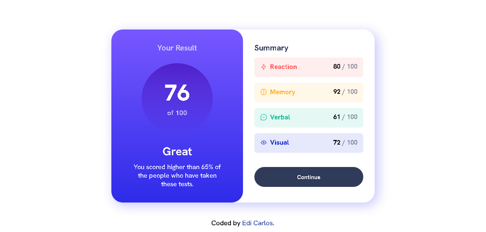

<h1 align="center">summary component challenge</h1>

This is a solution to the [Results summary component challenge on Frontend Mentor](https://www.frontendmentor.io/challenges/results-summary-component-CE_K6s0maV). 

## Table of contents

- [Overview](#overview)
  - [The challenge](#the-challenge)
  - [Links](#links)
- [My process](#my-process)
  - [Built with](#built-with)
- [Author](#author)

## Overview

### The challenge

Users should be able to:

- View the optimal layout for the interface depending on their device's screen size
- See hover and focus states for all interactive elements on the page

### Links

- Solution URL: [Repositório](https://github.com/ediCarlosSilva/results-summary-component)
- Live Site URL: [Deploy](https://results-summary-component-zeta-gules.vercel.app/)

## My process

### Built with

- Semantic HTML5 markup
- CSS custom properties
- Flexbox
- Javascript (Dynamic update of the values)

## Author

- Website - [Edi Carlos](https://edicarlossilva.github.io)
- Frontend Mentor - [@ediCarlosSilva](https://www.frontendmentor.io/profile/ediCarlosSilva)